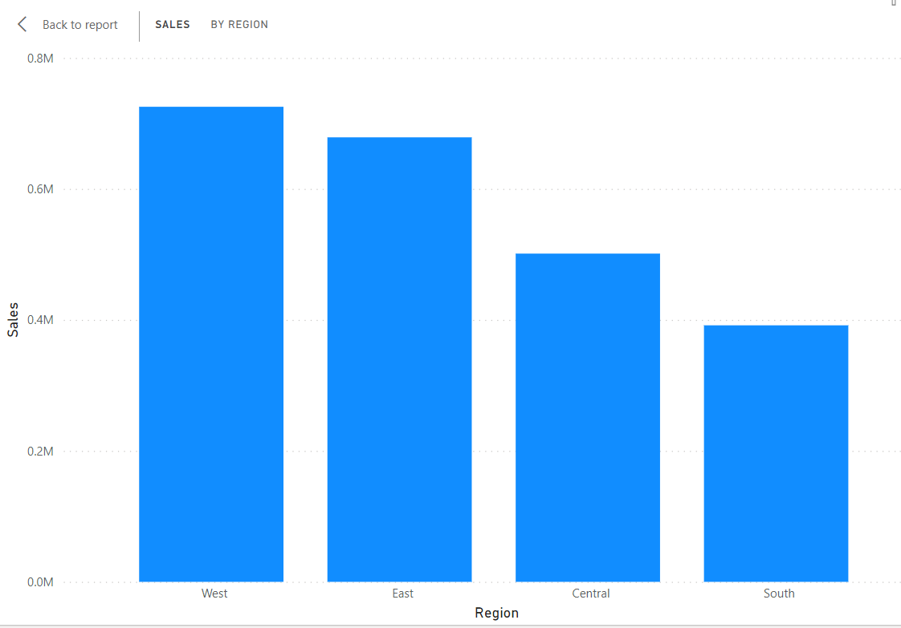
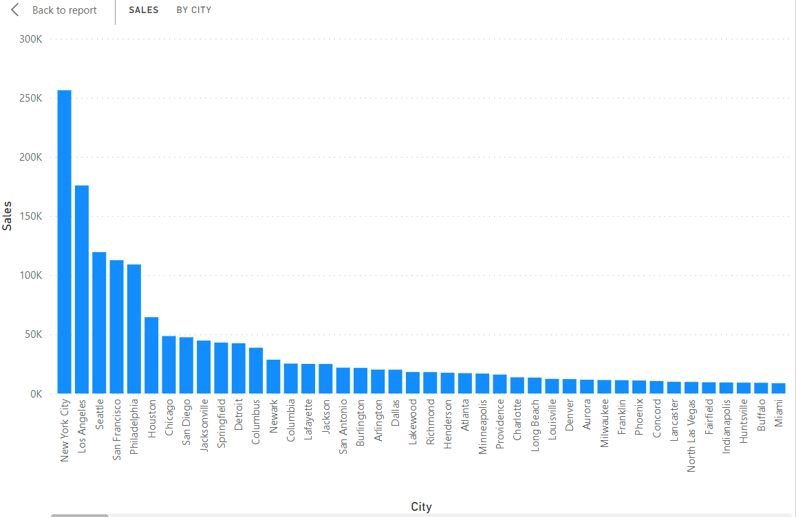
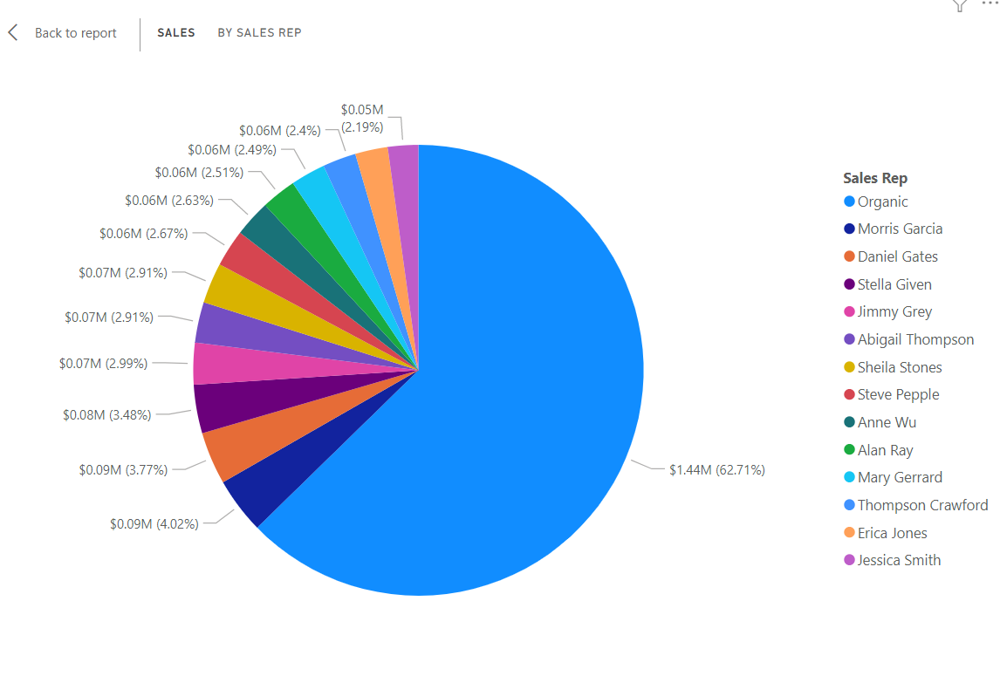
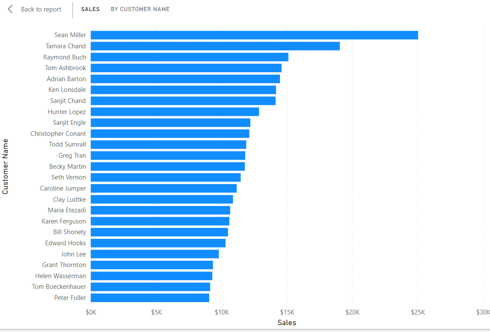

# Data-Modelling-with-Power-BI

## Introduction
This project is to display my data modelling skills acquired in the data analytics track of the NG30days of learning using POWER BI.The problem satatement is an imaginary case scenario I thought about after seeing the dataset. 

## Problem Statement
An international company in the United States wishes to build an Headquatre Officee in the location where the highest sales were made.
At the opening event, the stakeholders wish to award the customer with highest sales and also to appoint the best salesrep( i.e the salesrep that has made the highest sales) as the new Sales manager of the new headquatre.
The stakeholders have herby entrusted "data_doctor" with carrying out a quick analysis and report.

Data_Dr: After thinking critically, I could see three problems to be solved here.
1. Getting Region/location with the highest sales
2. Sales rep with the highest sales made.
3. Customer with highest sales

The dataset is an excel file saved locally in a folder. The file is  denormalized with all data in a single table.

## Data Sourcing
Data was normalized that is, the information wer categorically seperated into differnt sheets or tables resulting into 5 tables:
- Sales
- Customers
- Sales Reps
- Location
- Products

 Data was then locally extracted from Excel Workbook into Power BI for transformation, analysis and visualization.

## Data Transformation

Data cleaning was done per table.
The table appeared to be clean, however, 
For the Customers and Products Table, first rows were not headers and so resolved that by applying the "Use First ros as header" action.
column datatypes were validated appropriately.
column quality and profiles checked for valid, errors and emptiness and cleaned accordingly.

## Data Model Design
The data required to answer the questions of the stakeholders are located in various tables.
Therfore, appropriate modelling is required.
The Sales Table is the dimensions table containing all redundant data, and to which other required tables are modelled or connected to, using the 
column that is common.
Sales Table has been modelled with:
- SalesRep Table using the "SalesRep ID"
- Locations Table using the "Location ID"
- Products Table using "Product ID"
- Customers Tables via "Customer ID"

## Data Aanalysis/ Visualization
Analysis was done using simple visuals since the tables have been perfectly modelled together.

## Sales By Region

#### The western region had the highest sales with over 720k dollars.

Since only one headquatres would be built, I then had to drill down the regions to know the exact city with the highest sales.

With further visual analysis, It is interesting to discover that the City with the hihgest sales is not even situated in the Western region,
but in the eastern region and that is NewYork with a sales of over 250k dollars.

## Sales by SalesReps

Wow! ORGANIC has made over 1.4M dollars for the company. AMAZING.

## Sales By Customers

Obviously, Sean Miller happens to be the man in love with our company. It will be nice to encourage him by an award or a considerable discount for subsequent/future sales.

## Recommendations
- **NewYork City** is appropriate location/City to build the Office Headquatres 
- **Organic** has made the highest sales with a wide gap. We might need to interview Organic, I mean is there anythimg he is doing that the others are not?
- **Sean Miller** is the most precious customer at the moment and needs tp be compensated either by an award or consierable discounts on subsequent sales. 

*My goal is to provide value to stakeholders and not just build reports
