# Data-Modelling-with-Power-BI

## Introduction
This project is to display my data modelling skills acquired in the data analytics track of the NG30days of learning using POWER BI.The problem satatement is an imaginary case scenario I thought about after seeing the dataset. 

## Problem Statement
An international company in the United States wishes to build an Headquatre Officee in the location where the highest sales were made.
At the opening event, the stakeholders wish to award the customer with highest sales and also to appoint the best salesrep( i.e the salesrep that has made the highest sales) as the new Sales manager of the new headquatre.
The stakeholders have hereby entrusted "data_doctor" with carrying out a quick analysis and report.

After thinking critically, three questions need answers:
1. Which Region/location has the highest sales made?
2. Which Sales rep has made the highest sales?
3. Which of our Customers prchased highest sales?

The dataset is an excel file saved locally in a folder. The file is  [denormalised](https://github.com/Data-Dr-hub/Data-Modelling-with-Power-BI/blob/main/SuperStore_Denormalized.xlsx) with all data in a single table.

## Data Sourcing
Data was [normalised](https://github.com/Data-Dr-hub/Data-Modelling-with-Power-BI/blob/main/SuperStore_Normalized.xlsx) that is, the information was categorically seperated into differnt sheets or tables resulting into 5 tables:
- Sales
- Customers
- Sales Reps
- Location
- Products

Data was then locally extracted from Excel Workbook into Power BI for transformation, analysis and visualization.

## Data Transformation

Data cleaning was performed per table.
The table appeared to be clean.
The quality of each column is 100% with no error or nulls.
Below is a preview of the tables:

Customers Table             |           Location Table
:--------------------------:|:------------------------:
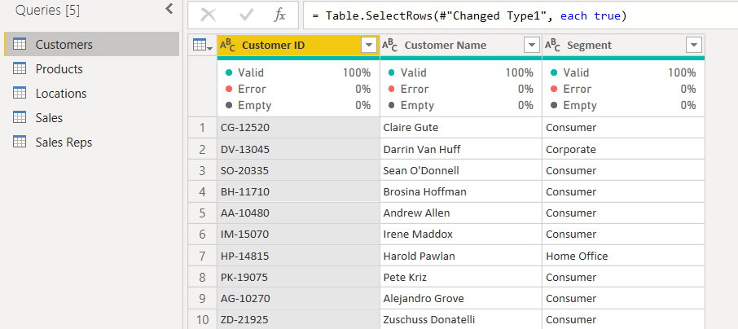          |         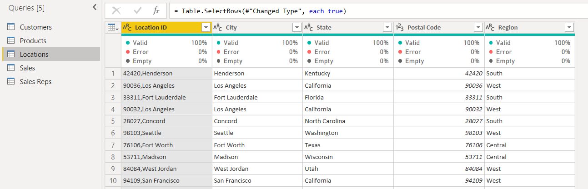

Products Table              |        Salesrep Table
:---------------------------:|:----------------------
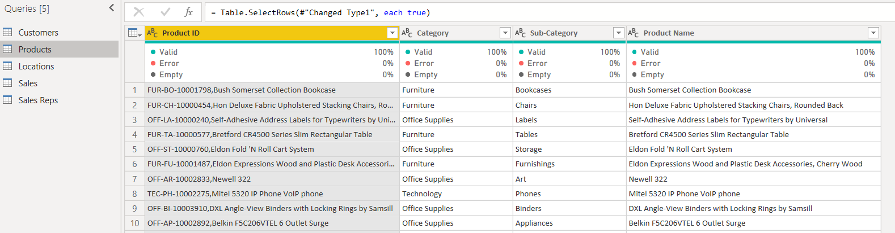             |     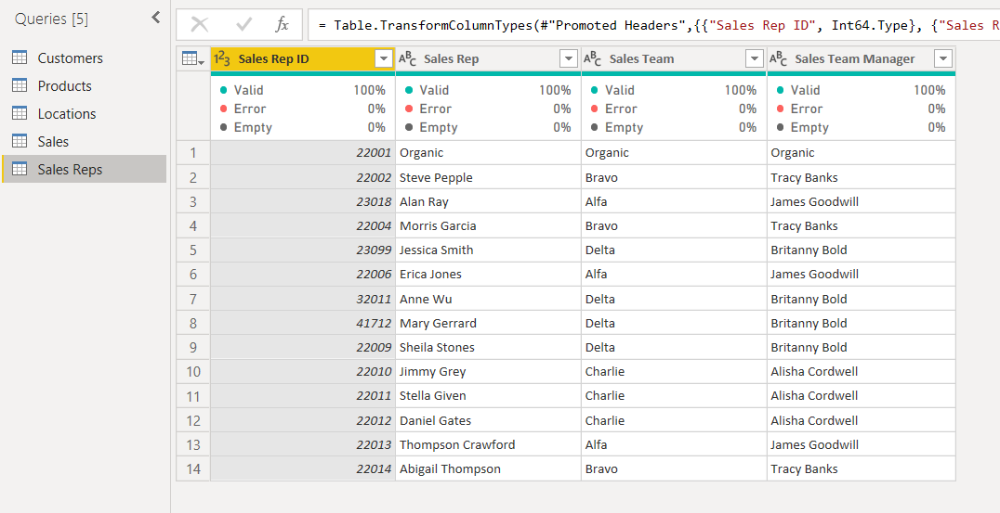

**Sales Table**
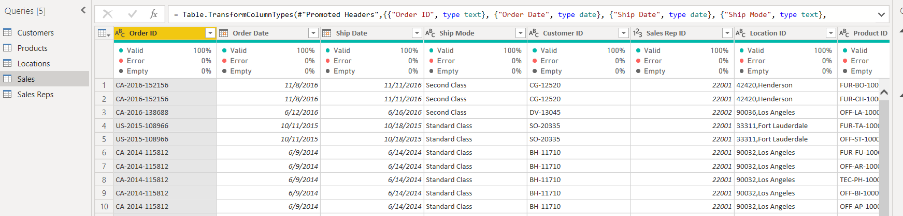

For the Customers and Products Table, first rows were not headers and so resolved that by applying the "Use First row as header" action.
column datatypes were validated appropriately.

## Data Model Design
The data required for this analysis are located in various tables.
Therfore, appropriate modelling is required.
A star Schema is designed with the Sales Table representing the fact table containing all redundant data, and to which other dimension tables are modelled or connected to, using the column that is common.
Sales Table has been modelled with:
- SalesRep Table using the "SalesRep ID"
- Locations Table using the "Location ID"
- Products Table using "Product ID"
- Customers Tables via "Customer ID"

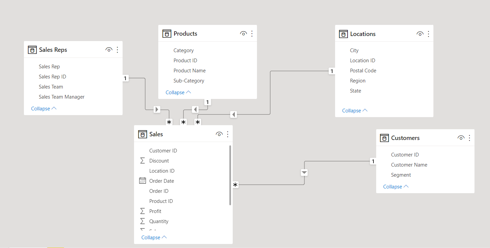

## Data Aanalysis/ Visualization
Analysis was done using simple visuals since the tables have been perfectly modelled together.

## Sales By Region

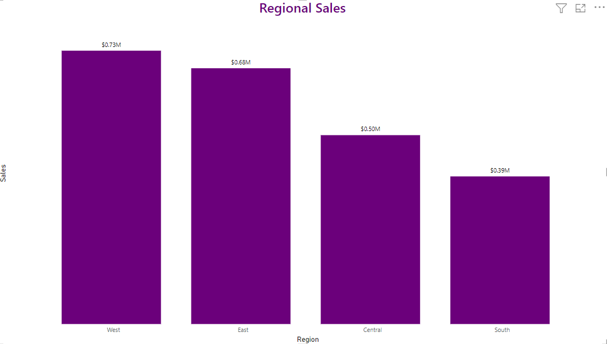

#### The western region had the highest sales with over 720k dollars.

Since only one office would be built, I then had to drill down the regions to know the exact city with the highest sales.

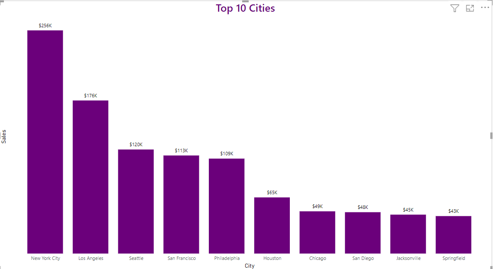

With further visual analysis, It is interesting to discover that the City with the hihgest sales is not even situated in the Western region,
but in the eastern region and that is NewYork with a sales of over 250k dollars.

## Sales by SalesReps

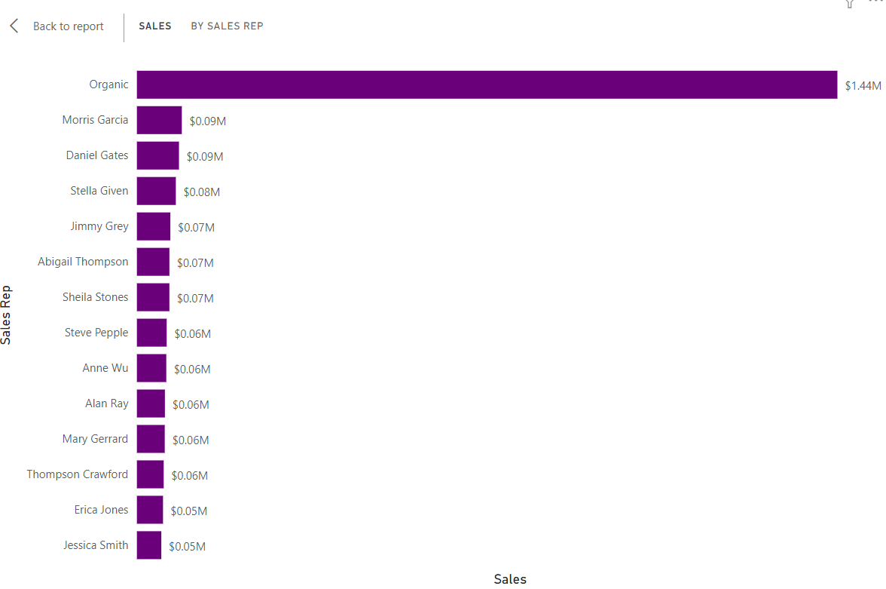

Hmmm! something seems not to be right here. "ORGANIC" is definitely an outlier. After making more enquiries from the stakeholders, I got to know that the term "Organic" refers to sales made **without** the help of the salesreps and should thus be excluded:

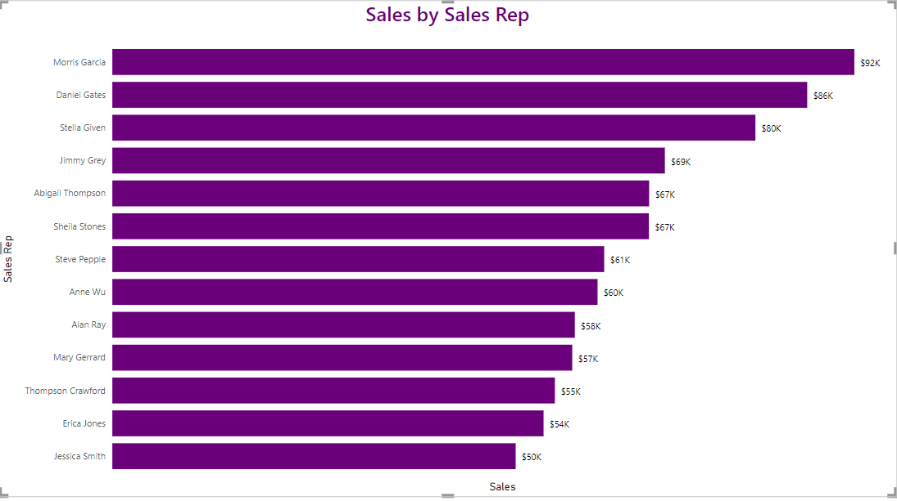

Morris Garcia has the highest sales.

## Sales By Customers

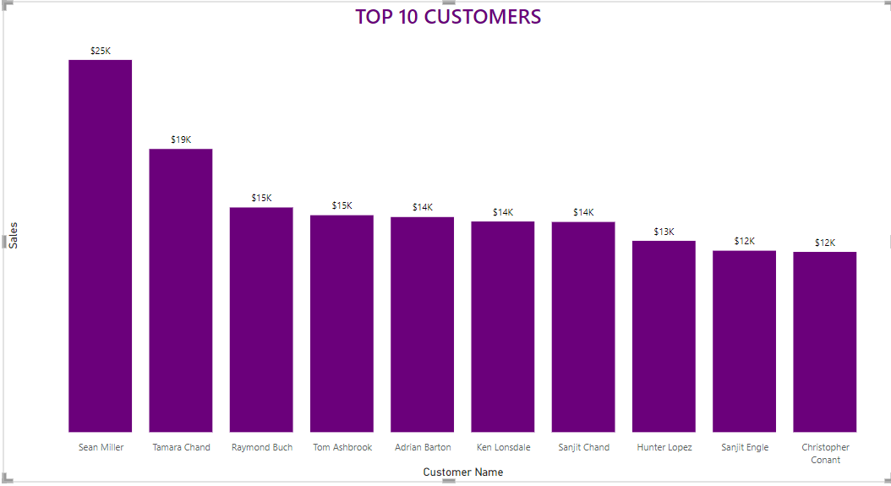

Obviously, Sean Miller happens to be the man in love with our company. It will be nice to encourage him by an award or a considerable discount for subsequent/future sales.

## Conclusions/Recommendations
- **NewYork City** is appropriate location/City to build the Office Headquatres 
- **Morris Garcia** should be the Sales Manager for the new headquatre Office.
- **Sean Miller** is the most precious customer at the moment and needs tp be compensated either by an award or consierable discounts on subsequent sales. 
------

###### My goal is to provide value to the stakeholders and not just to build reports and dashboard. 

Thank you.

